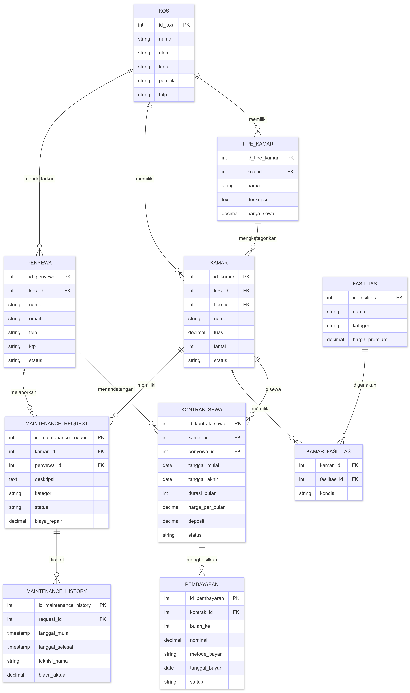

# Bagian 1: Identifikasi Masalah

## 1.1 Nama Sistem

**Sistem Manajemen Kos-Kosan "KosPat"**

---

## 1.2 Latar Belakang Masalah

Pengelolaan kos-kosan di Indonesia terutama di balikpapan menghadapi beberapa tantangan operasional:

1. **Manajemen Kamar yang Kompleks**: Pemilik kos sulit melacak status kamar (kosong, terisi, sedang direnovasi), data penyewa, dan riwayat penghuni.

2. **Pembayaran Sewa Tidak Terpantau**: Sering terjadi keterlambatan pembayaran karena tidak ada sistem reminder otomatis dan pencatatan manual yang sering terjadi kesalahan.

3. **Administrasi Fasilitas Kamar Berantakan**: Data fasilitas kamar (AC, WiFi, water heater) tidak terdokumentasi dengan baik, sehingga sulit membedakan harga sewa berdasarkan fasilitas.

4. **Keluhan dan Maintenance Tidak Terorganisir**: Keluhan penyewa tentang fasilitas rusak tidak terdokumentasi, sehingga perbaikan sering tertunda atau terlupakan.

5. **Laporan Keuangan Manual**: Pemilik kos membuat laporan keuangan manual, rawan kesalahan, dan sulit analisis trend pendapatan.

6. **Kesulitan Analisis Bisnis**: Sulit mengetahui kapan musim sepi/ramai, berapa occupancy rate, dan data penyewa mana yang loyal.

**Solusi yang Ditawarkan:**
Sistem database terintegrasi yang mengelola data kamar, penyewa, pembayaran, fasilitas, maintenance, dan menghasilkan laporan bisnis otomatis.

---

## 1.3 Requirement Utama

### Fitur Fungsional (Minimal 5):

1. **Manajemen Kamar**
   - Tambah/edit/hapus data kamar dengan nomor, tipe, luas, harga sewa
   - Status kamar: kosong, terisi, maintenance, reserved
   - Foto/dokumen kamar 

2. **Manajemen Penyewa**
   - Data penyewa: nama, email, telepon, KTP, data keluarga
   - Tracking riwayat penyewa (siapa saja pernah tinggal di kamar X, berapa lama)
   - Status penyewa: aktif, non-aktif, blacklist

3. **Manajemen Sewa dan Pembayaran**
   - Kontrak sewa: tanggal mulai, durasi, harga, fasilitas included
   - Pencatatan pembayaran: nominal, tanggal, metode, status
   - Reminder keterlambatan pembayaran otomatis

4. **Manajemen Fasilitas**
   - Data fasilitas di kamar: AC, WiFi, water heater, kasur, meja
   - Kategori fasilitas dan harga premium per fasilitas
   - History perubahan fasilitas

5. **Manajemen Maintenance**
   - Keluhan/request perbaikan dari penyewa
   - Status repair: open, in-progress, completed
   - Biaya maintenance (gratis atau dibayar penyewa)
   - History maintenance per kamar

6. **Laporan dan Analitik** (Bonus)
   - Total pendapatan per bulan/tahun
   - Occupancy rate per kamar/bulan
   - Daftar penyewa dengan kemudahan identifikasi yang bayar/belum
   - Analisis durasi tinggal rata-rata
   - Kamar mana yang paling menguntungkan

---

## 1.4 Kebutuhan OLTP (Online Transaction Processing)

Transaksi harian/operasional yang sering terjadi:

1. **Checkin Penyewa Baru**
   - Insert data penyewa baru
   - Update status kamar menjadi "terisi"
   - Insert kontrak sewa
   - Hitung tenggat waktu pembayaran

2. **Pembayaran Sewa**
   - Input pembayaran dari penyewa
   - Update status pembayaran ("paid"/"unpaid")
   - Insert ke tabel transaksi_pembayaran
   - Generate invoice/bukti pembayaran

3. **Checkout Penyewa**
   - Update status kamar menjadi "kosong"
   - Update tanggal checkout
   - Hitung denda/pengembalian deposit (jika ada)
   - Archive data sewa

4. **Lapor Keluhan/Maintenance**
   - Penyewa lapor fasilitas rusak
   - Insert ke tabel maintenance_request
   - Assign ke pekerja maintenance
   - Update status (open → in-progress → completed)

5. **Update Status Kamar**
   - Ubah status kamar (kosong → maintenance → terisi)
   - Tracking history status change

---

## 1.5 Kebutuhan OLAP (Online Analytical Processing)

Laporan/analisis yang dibutuhkan untuk bisnis insight:

1. **Dashboard Keuangan**
   - Total pendapatan bulan ini vs bulan lalu
   - Breakdown pendapatan per kamar/tipe kamar
   - Prediksi pendapatan 3 bulan ke depan
   - Analisis pembayaran tepat waktu vs terlambat

2. **Analisis Occupancy**
   - Occupancy rate per bulan (berapa % kamar terisi)
   - Kamar mana yang paling sering kosong
   - Rata-rata durasi penyewa tinggal
   - Seasonal pattern (musim ramai/sepi)

3. **Analisis Penyewa**
   - Daftar penyewa aktif
   - Penyewa loyal (stay > 1 tahun)
   - Penyewa problem (sering terlambat bayar, banyak komplain)
   - Segmentasi penyewa berdasarkan durasi tinggal

4. **Analisis Maintenance**
   - Kamar mana yang paling sering rusak
   - Rata-rata waktu response maintenance
   - Total biaya maintenance per kamar/bulan
   - Tren keluhan (fasilitas apa yang paling sering rusak)

5. **Performa Bisnis**
   - Pendapatan per kamar per tahun
   - Gross margin per kamar (revenue - maintenance cost)
   - Tingkat penyewa yang bertahan 
   - Penyewa yang berhenti sewa 

---

## 1.6 Ringkasan Requirement

| Aspek | Detail |
|-------|--------|
| **Domain** | Manajemen Kos-kosan |
| **Tujuan** | Automasi administrasi, tracking pembayaran, analisis bisnis |
| **Stakeholder Utama** | Pemilik kos, penyewa, maintenance staff |
| **Fitur Core** | Kamar, Penyewa, Sewa, Pembayaran, Fasilitas, Maintenance |
| **Volume Data** | ~50-100 penyewa aktif, ~20-30 kamar |
| **Transaksi/hari** | 5-10 transaksi (payment, checkin/checkout, complaint) |
| **Query Analytics** | Minimal 5 report utama per bulan |

---

# Bagian 2: Desain Database

## 2.1 Entity Relationship Diagram (ERD)

### Deskripsi Entitas dan Relasi:

```
Entitas Utama:
1. kos (Kos - data induk kos-kosan)
2. kamar (Kamar - unit kamar yang disewakan)
3. tipe_kamar (Tipe Kamar - kategori harga kamar)
4. penyewa (Penyewa - data penghuni)
5. kontrak_sewa (Kontrak Sewa - perjanjian sewa)
6. pembayaran (Pembayaran - transaksi pembayaran)
7. fasilitas (Fasilitas - amenities di kamar)
8. kamar_fasilitas (Pivot - relasi kamar & fasilitas, N:M)
9. maintenance_request (Keluhan/Maintenance - laporan kerusakan)
10. maintenance_history (History Maintenance - riwayat perbaikan)
```

### Relasi Kardinalitas:

```
1. KOS → TIPE_KAMAR : 1 kos memiliki banyak tipe kamar (1:N)

2. KOS → KAMAR : 1 kos memiliki banyak kamar (1:N)

3. KOS → PENYEWA : 1 kos mendaftarkan banyak penyewa (1:N)

4. TIPE_KAMAR → KAMAR : 1 tipe kamar mengkategorikan banyak kamar (1:N)

5. KAMAR → KONTRAK_SEWA : 1 kamar bisa memiliki banyak kontrak sewa (bergantian penyewa) (1:N)

6. PENYEWA → KONTRAK_SEWA : 1 penyewa bisa memiliki banyak kontrak sewa (pindah kamar, perpanjang) (1:N)

7. KONTRAK_SEWA → PEMBAYARAN : 1 kontrak menghasilkan banyak pembayaran (per bulan) (1:N)

8. KAMAR → KAMAR_FASILITAS : 1 kamar bisa punya banyak fasilitas (1:N)

9. FASILITAS → KAMAR_FASILITAS : 1 fasilitas bisa ada di banyak kamar (1:N)

10. KAMAR ↔ FASILITAS : relasi many-to-many melalui tabel pivot KAMAR_FASILITAS (N:M)

11. KAMAR → MAINTENANCE_REQUEST : 1 kamar bisa punya banyak laporan kerusakan (1:N)

12. PENYEWA → MAINTENANCE_REQUEST : 1 penyewa bisa mengajukan banyak laporan (1:N)

13. MAINTENANCE_REQUEST → MAINTENANCE_HISTORY : 1 laporan bisa punya banyak riwayat penanganan (1:N)
```

---

## 2.2 Visual ERD kos-kosan




---


## 2.3 Trade-off Analysis

### KEPUTUSAN 1: Gunakan Nomor Urut Buatan vs Menggunakan Nomor Kamar Asli

**Pilihan:** Menggunakan Nomor Urut Buatan (1, 2, 3, ...)

**Penjelasan Sederhana:**
Ada 2 cara untuk memberi label unik pada setiap kamar:

1. **Nomor Urut Buatan** (seperti nomor antrian)
   - Sistem database membuat nomor otomatis: 1, 2, 3, 4, dst
   - Nomor ini tidak pernah berubah
   - Mirip seperti nomor urut peserta dalam perlombaan

2. **Nomor Kamar Asli** (seperti nomor rumah)
   - Menggunakan nomor kamar yang sudah ada: "101", "A5", dst
   - Tapi nomor ini bisa berubah saat renovasi atau perubahan tata letak

**Alasan Memilih Nomor Urut Buatan:**
- Nomor kamar asli sering berubah (saat renovasi atau relayout gedung)
- Nomor urut buatan tidak pernah berubah dan stabil
- Database bekerja lebih cepat dengan angka sederhana dibanding teks
- Tetap menyimpan nomor kamar asli untuk referensi manusia

**Analogi:**
Seperti perbedaan antara:
- Nomor Urut Buatan = Nomor Member di toko (yang tidak pernah berubah)
- Nomor Kamar Asli = Alamat rumah kita (bisa berubah saat pindah)

**Trade-off:**
- Perlu 1 kolom tambahan untuk nomor urut (sedikit lebih banyak tempat)
- **Tapi ini sebanding:** Keamanan data dan kemudahan pengelolaan lebih penting

**Alternatif yang Ditolak:**
- Hanya pakai nomor kamar asli saja: Risky karena bisa duplikat/berubah
- Menggunakan UUID (kode panjang random): Tidak perlu sekaligus memboroskan tempat

---

### KEPUTUSAN 2: JSONB untuk Fasilitas Kamar (Flexible Attributes)

**Pilihan:** Tabel terpisah KAMAR_FASILITAS (normalized)

**Alasan:**
- Pemilik kos mungkin ingin menambah fasilitas baru tanpa alter tabel
- Setiap kamar bisa punya kombinasi fasilitas yang berbeda
- Mudah untuk query "kamar apa saja yang punya WiFi?"
- Efisien untuk index pada fasilitas spesifik

**Trade-off:**
- Lebih kompleks: perlu JOIN untuk ambil semua fasilitas kamar
- Storage sedikit lebih banyak (tabel pivot)
- **Benefit > Cost**: Fleksibilitas dan queryability > JOIN overhead

**Alternatif yang Ditolak:**
- Kolom fasilitas_names: VARCHAR(500) - tidak fleksibel, sulit di-index
- JSONB array di tabel kamar - sulit di-query, tidak bisa index individual item

---

### KEPUTUSAN 3: Normalisasi vs Pengulangan untuk Tracking Pembayaran

**Pilihan:** Tabel PEMBAYARAN terpisah dengan status per bulan

**Alasan:**
- Setiap bulan bisa ada 1 pembayaran atau lebih (lunas sekaligus, cicilan)
- Mudah track bulan mana yang belum dibayar
- Fleksibel untuk multiple payment per bulan
- Audit trail lengkap (siapa bayar kapan berapa)

**Trade-off:**
- Perlu JOIN untuk cek total pembayaran kontrak
- Denormalisasi: bisa tambah kolom "total_pembayaran" di KONTRAK_SEWA (redundan)
- **Benefit > Cost**: Audit trail dan fleksibilitas pembayaran > denormalisasi

**Alternatif yang Ditolak:**
- Pembayaran sebagai JSON di KONTRAK_SEWA - sulit di-query dan di-index
- One row per kontrak dengan hardcoded bulan1, bulan2, dll - tidak fleksibel

---

### KEPUTUSAN 4: Kontrak Berakhir vs Soft-Delete vs Archive

**Pilihan:** Kontrak tetap di tabel dengan status "berakhir"

**Alasan:**
- Perlu history lengkap untuk analisis
- Soft-delete menjaga audit trail
- Tetap bisa di-query untuk laporan historis

**Trade-off:**
- Tabel akan besar seiring waktu
- Query harus filter status 'aktif' jika tidak ingin data lama

**Mitigasi:** Buat INDEX pada (penyewa_id, status) untuk query efisien

---

## 2.5 Bukti Normalisasi (3NF)

Untuk membuktikan bahwa desain database telah memenuhi Third Normal Form (3NF), dipilih dua tabel utama yang memiliki potensi redundansi dan repeating group, yaitu:

1. Tabel KAMAR  
2. Tabel KONTRAK_SEWA  

Proses normalisasi dilakukan bertahap dari UNF hingga 3NF untuk memastikan:
- tidak ada repeating group,
- tidak ada partial dependency,
- tidak ada transitive dependency.

---

## SOAL 1: Normalisasi Tabel KAMAR

## Bentuk Tidak Normal (UNF)

| kamar_id | nomor_kamar | kos_id | tipe_kamar | harga_sewa | fasilitas_dimiliki |
|---|---|---|---|---|---|
| 1 | 101 | 1 | Reguler | 500000 | AC, WiFi, Water Heater |
| 2 | 102 | 1 | Reguler | 500000 | AC, WiFi |
| 3 | 201 | 1 | Premium | 750000 | AC, WiFi, TV, Kulkas |

---

## Permasalahan UNF

1. Kolom `fasilitas_dimiliki` memiliki banyak nilai dalam satu kolom (repeating group).  
2. Data `tipe_kamar` dan `harga_sewa` berulang pada banyak kamar.  
3. Data fasilitas sulit di-query dan tidak fleksibel.  

---

## Normalisasi ke 1NF

## Aturan 1NF
- Setiap atribut harus bernilai tunggal (atomic).
- Tidak boleh ada repeating group.

## Hasil 1NF

### Tabel KAMAR

| kamar_id | nomor_kamar | kos_id | tipe_kamar | harga_sewa |
|---|---|---|---|---|
| 1 | 101 | 1 | Reguler | 500000 |
| 2 | 102 | 1 | Reguler | 500000 |
| 3 | 201 | 1 | Premium | 750000 |

### Tabel KAMAR_FASILITAS

| kamar_id | fasilitas |
|---|---|
| 1 | AC |
| 1 | WiFi |
| 1 | Water Heater |
| 2 | AC |
| 2 | WiFi |
| 3 | AC |
| 3 | WiFi |
| 3 | TV |
| 3 | Kulkas |

---

## Penjelasan 1NF

Pada tahap ini:
- kolom `fasilitas_dimiliki` dipisahkan agar setiap kolom hanya memiliki satu nilai,
- repeating group berhasil dihilangkan,
- data menjadi atomic.

---

## Normalisasi ke 2NF

## Aturan 2NF
- Sudah memenuhi 1NF.
- Tidak boleh ada partial dependency.

## Analisis

Atribut:
- `harga_sewa`
- `tipe_kamar`

masih saling bergantung dan berulang pada banyak kamar dengan tipe yang sama.

---

## Hasil 2NF

### Tabel TIPE_KAMAR

| tipe_id | tipe_kamar | harga_sewa |
|---|---|---|
| 1 | Reguler | 500000 |
| 2 | Premium | 750000 |

### Tabel KAMAR

| kamar_id | nomor_kamar | kos_id | tipe_id |
|---|---|---|---|
| 1 | 101 | 1 | 1 |
| 2 | 102 | 1 | 1 |
| 3 | 201 | 1 | 2 |

### Tabel KAMAR_FASILITAS

| kamar_id | fasilitas |
|---|---|
| 1 | AC |
| 1 | WiFi |
| 1 | Water Heater |
| 2 | AC |
| 2 | WiFi |
| 3 | AC |
| 3 | WiFi |
| 3 | TV |
| 3 | Kulkas |

---

## Penjelasan 2NF

Pada tahap ini:
- data tipe kamar dipisahkan ke tabel `TIPE_KAMAR`,
- redundansi data harga sewa berhasil dikurangi,
- setiap atribut non-key sudah bergantung penuh pada primary key.

---

## Normalisasi ke 3NF

## Aturan 3NF
- Sudah memenuhi 2NF.
- Tidak boleh ada transitive dependency.

## Analisis

Data fasilitas masih berupa teks berulang sehingga dipisahkan ke tabel fasilitas tersendiri agar lebih efisien dan fleksibel.

Relasi antara `KAMAR` dan `FASILITAS` merupakan many-to-many:
- satu kamar dapat memiliki banyak fasilitas,
- satu fasilitas dapat dimiliki banyak kamar.

Karena itu dibuat tabel penghubung `KAMAR_FASILITAS`.

---

## Hasil 3NF

### Tabel TIPE_KAMAR

| tipe_id | tipe_kamar | harga_sewa |
|---|---|---|
| 1 | Reguler | 500000 |
| 2 | Premium | 750000 |

### Tabel KAMAR

| kamar_id | nomor_kamar | kos_id | tipe_id |
|---|---|---|---|
| 1 | 101 | 1 | 1 |
| 2 | 102 | 1 | 1 |
| 3 | 201 | 1 | 2 |

### Tabel FASILITAS

| fasilitas_id | nama_fasilitas |
|---|---|
| 1 | AC |
| 2 | WiFi |
| 3 | Water Heater |
| 4 | TV |
| 5 | Kulkas |

### Tabel KAMAR_FASILITAS

| kamar_id | fasilitas_id |
|---|---|
| 1 | 1 |
| 1 | 2 |
| 1 | 3 |
| 2 | 1 |
| 2 | 2 |
| 3 | 1 |
| 3 | 2 |
| 3 | 4 |
| 3 | 5 |

---

## Kesimpulan Soal 1

Tabel KAMAR telah memenuhi:
- 1NF karena data sudah atomic,
- 2NF karena tidak ada partial dependency,
- 3NF karena tidak ada transitive dependency dan relasi many-to-many telah dipisahkan dengan tabel pivot.

---

## SOAL 2: Normalisasi Tabel KONTRAK_SEWA

## Bentuk Tidak Normal (UNF)

| kontrak_id | kamar_id | penyewa_id | penyewa_nama | nomor_kamar | pembayaran_bulan1 | pembayaran_bulan2 | pembayaran_bulan3 |
|---|---|---|---|---|---|---|---|
| 1 | 1 | 1 | Budi | 101 | 500000 | 500000 | - |
| 2 | 2 | 2 | Ani | 102 | 500000 | - | - |

---

## Permasalahan UNF

1. Terdapat repeating group pada kolom pembayaran.  
2. Data `penyewa_nama` dan `nomor_kamar` redundan.  
3. Struktur pembayaran tidak fleksibel untuk penambahan bulan baru.  

---

## Normalisasi ke 1NF

## Hasil 1NF

### Tabel KONTRAK_SEWA

| kontrak_id | kamar_id | penyewa_id | penyewa_nama | nomor_kamar |
|---|---|---|---|---|
| 1 | 1 | 1 | Budi | 101 |
| 2 | 2 | 2 | Ani | 102 |

### Tabel PEMBAYARAN

| pembayaran_id | kontrak_id | bulan | jumlah_bayar |
|---|---|---|---|
| 1 | 1 | 1 | 500000 |
| 2 | 1 | 2 | 500000 |
| 3 | 2 | 1 | 500000 |

---

## Penjelasan 1NF

Pada tahap ini:
- repeating group pembayaran dipisahkan,
- setiap pembayaran menjadi satu baris data,
- data menjadi lebih fleksibel.

---

## Normalisasi ke 2NF

## Analisis

- `penyewa_nama` bergantung pada `penyewa_id`
- `nomor_kamar` bergantung pada `kamar_id`

Maka atribut tersebut dipisahkan ke tabel masing-masing.

---

## Hasil 2NF

### Tabel PENYEWA

| penyewa_id | penyewa_nama |
|---|---|
| 1 | Budi |
| 2 | Ani |

### Tabel KAMAR

| kamar_id | nomor_kamar |
|---|---|
| 1 | 101 |
| 2 | 102 |

### Tabel KONTRAK_SEWA

| kontrak_id | kamar_id | penyewa_id |
|---|---|---|
| 1 | 1 | 1 |
| 2 | 2 | 2 |

### Tabel PEMBAYARAN

| pembayaran_id | kontrak_id | bulan | jumlah_bayar |
|---|---|---|---|
| 1 | 1 | 1 | 500000 |
| 2 | 1 | 2 | 500000 |
| 3 | 2 | 1 | 500000 |

---

## Normalisasi ke 3NF

## Analisis

Semua atribut non-key sudah bergantung langsung pada primary key masing-masing tabel dan tidak ada ketergantungan transitif.

---

## Hasil 3NF

### Tabel PENYEWA

| penyewa_id | penyewa_nama |
|---|---|
| 1 | Budi |
| 2 | Ani |

### Tabel KAMAR

| kamar_id | nomor_kamar |
|---|---|
| 1 | 101 |
| 2 | 102 |

### Tabel KONTRAK_SEWA

| kontrak_id | kamar_id | penyewa_id |
|---|---|---|
| 1 | 1 | 1 |
| 2 | 2 | 2 |

### Tabel PEMBAYARAN

| pembayaran_id | kontrak_id | bulan | jumlah_bayar |
|---|---|---|---|
| 1 | 1 | 1 | 500000 |
| 2 | 1 | 2 | 500000 |
| 3 | 2 | 1 | 500000 |

---

## Kesimpulan

Tabel KONTRAK_SEWA telah memenuhi:
- 1NF karena data pembayaran sudah atomic,
- 2NF karena atribut non-key bergantung penuh pada primary key,
- 3NF karena tidak ada transitive dependency dan redundansi data berhasil dikurangi.


# Hasil Explain Analyze

Sebelum Optimasi 
